# django-k8-sample
This is a sample django project deployable to Oracle Kubernetes Engine

# Getting Started on ubuntu

Configuring OCI CLI:
```shell
$ sudo runuser -l ubuntu -c 'mkdir -p /home/ubuntu/oci_cli'
$ sudo runuser -l ubuntu -c 'wget https://raw.githubusercontent.com/oracle/oci-cli/master/scripts/install/install.sh'
$ sudo runuser -l ubuntu -c 'chmod +x install.sh'
$ sudo runuser -l ubuntu -c '/home/ubuntu/install.sh --install-dir /home/ubuntu/oci_cli/lib/oracle-cli --exec-dir /home/ubuntu/oci_cli/bin --accept-all-defaults'
```

Finish the OCI CLI configuration by generating an OCI config file in ~/.oci/config. Your config file should look something like this:

```shell 
[DEFAULT]
user=ocid1.user.oc1..fooruser
fingerprint=11:32:10:d8:52:43:dd:86:0a:04:0f:47:23:be:72:70
tenancy=ocid1.tenancy.oc1..bartenancy
region=re-region-1
key_file=/foo/bar/path/api_private_key.pem
```
Finally run: 

```shell
$ sudo runuser -l ubuntu -c 'oci setup repair-file-permissions --file /home/ubuntu/.oci/config'
```

Installing Docker:
```shell
$ sudo apt-get update

$ sudo apt-get install \
    ca-certificates \
    curl \
    gnupg \
    lsb-release

$ sudo apt-get install docker-ce docker-ce-cli containerd.io

$ sudo apt install docker.io -y
```

Docker post-installation:
```
$  sudo usermod -a -G docker $USER
$  sudo systemctl enable docker.service
$  sudo systemctl start docker.service
$  sudo chmod 666 /var/run/docker.sock
```

Installing pip3:
```shell
$ sudo apt install python3-pip
```

Installing kubectl:
```shell
$ sudo apt-get update
$ sudo apt-get install -y apt-transport-https ca-certificates curl
$ sudo curl -fsSLo /usr/share/keyrings/kubernetes-archive-keyring.gpg https://packages.cloud.google.com/apt/doc/apt-key.gpg
$ echo "deb [signed-by=/usr/share/keyrings/kubernetes-archive-keyring.gpg] https://apt.kubernetes.io/ kubernetes-xenial main" | sudo tee /etc/apt/sources.list.d/kubernetes.list
$ sudo apt-get update
$ sudo apt-get install -y kubectl
```

Installking k9s (optional):
```shell
$ mkdir -p /home/ubuntu/k9s_installer
$ wget https://github.com/derailed/k9s/releases/download/v0.25.18/k9s_Linux_arm64.tar.gz -P /home/ubuntu/k9s_installer
$ tar -xvf /home/ubuntu/k9s_installer/k9* -C /home/ubuntu/k9s_installer
$ sudo cp /home/ubuntu/k9s_installer/k9s /usr/bin
$ rm -rf /home/ubuntu/k9s_installer
```

Commands ran: 

```shell
ubuntu@dalquintubuntuarm:~/REPOS/django-k8-sample$ source venv/bin/activate
ubuntu@dalquintubuntuarm:~/REPOS/django-k8-sample$ mkdir web
(venv) ubuntu@dalquintubuntuarm:~/REPOS/django-k8-sample$ cd web/
(venv) ubuntu@dalquintubuntuarm:~/REPOS/django-k8-sample/web$ django-admin startproject django_k8s_sample .

```
For testing the deployment: 

```shell
cd /home/ubuntu/REPOS/django-k8-sample/web
/home/ubuntu/REPOS/django-k8-sample/venv/bin/gunicorn django_k8s.wsgi:application
```

# For Docker. 

1. Create file `.dockerignore`inside web directory and copy all the contents from `.gitignore`into it
2. Create the `Dockerfile`file in web directory and set the content
3. Create file `entrypoint.sh` with it's corresponding content

4. Write the `docker-compose.yaml`file
5. Run `docker-compose up` This will build the image
    Note: You can run `docker system prune -a` to wipe out all
    You can stop the container by running `docker-compose down`
    You can force the re-build of image by running `docker-compose up --build`
6. If everything goes fine, when opening `http://localhost:8020` will show something like this

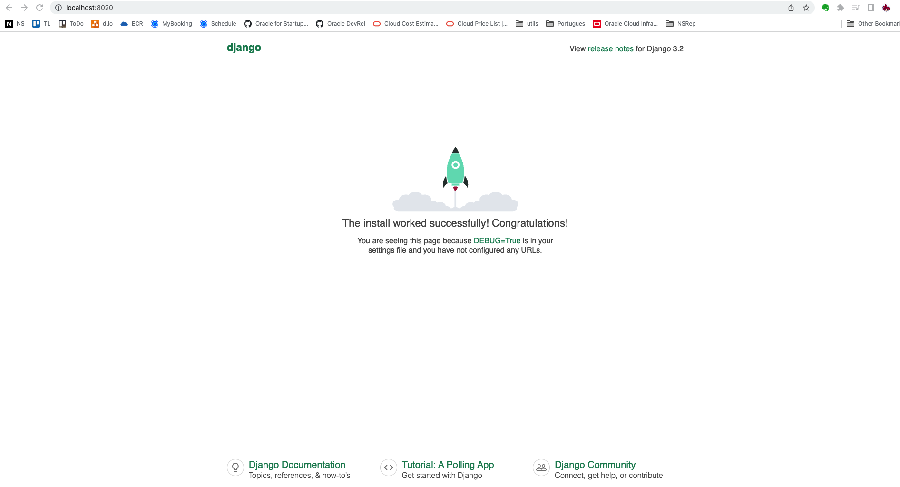


7. Access the folllwing site: 
    `http://localhost:8020/admin/login/?next=/admin/`


You will see something like this: 


Pass on User and Password located at .env under `DJANGO_SUPERUSER_USERNAME` and `DJANGO_SUPERUSER_PASSWORD`

8. You will see something like this now: 

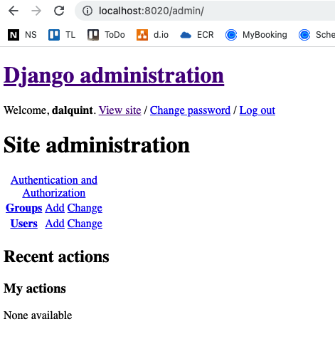


# Pushing the image to OCIR 

Follow instructions in this link: https://www.oracle.com/webfolder/technetwork/tutorials/obe/oci/registry/index.html


1. For your user, create an auth-token

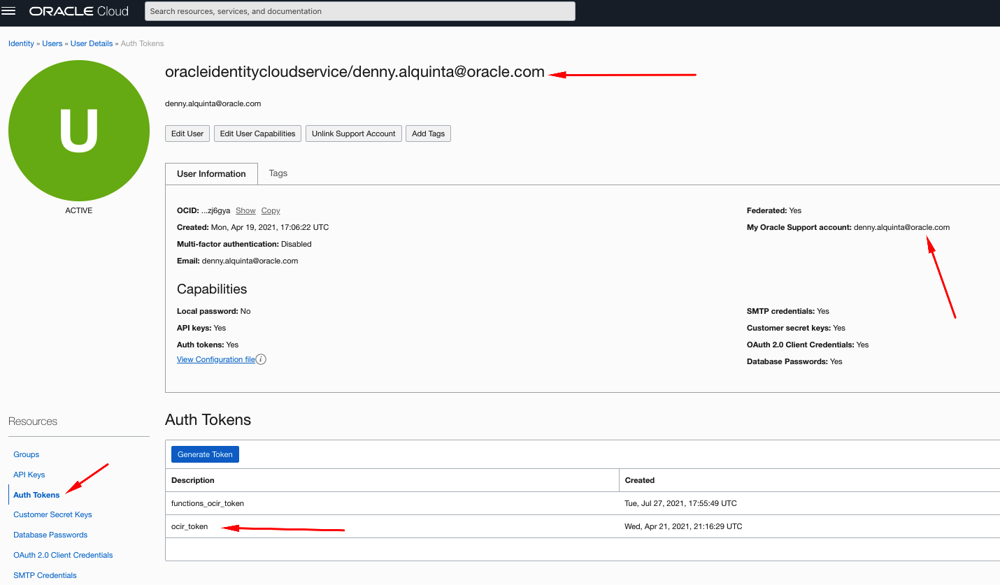

2. Select a region where you will do the deployment. In my case sa-santiago-1

3. Create a repository: (in this case `django-sample-app-k8s` and `django-sample-nginx-k8s`)

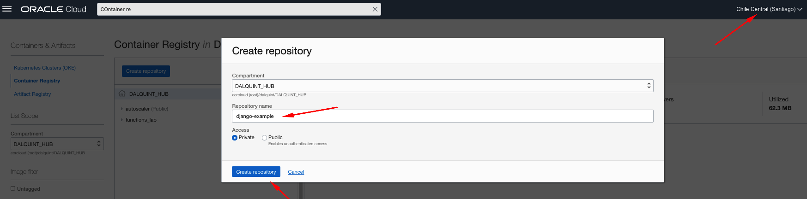

4. Login into OCIR with docker CLI

`$ docker login sa-santiago-1.ocir.io`

Username: <tenancy-namespace>/oracleidentitycloudservice/john.doe@domain.com
Password: auth-token from step 1. 

Example

```shell
(venv) ubuntu@dalquintubuntuarm:~/REPOS/django-k8-sample/k8s_deployment/nginx$ docker login sa-santiago-1.ocir.io
Username: idhkis4m3p5e/oracleidentitycloudservice/denny.alquinta@oracle.com
Password: 
WARNING! Your password will be stored unencrypted in /home/ubuntu/.docker/config.json.
Configure a credential helper to remove this warning. See
https://docs.docker.com/engine/reference/commandline/login/#credentials-store

Login Succeeded
```

5. Rebuild the image and Tag it

`$ docker-compose up --build`

5.1 Get the name of the image: 

```shell
(venv) ubuntu@dalquintubuntuarm:~/REPOS/django-k8-sample/k8s_deployment$ docker image ls
REPOSITORY         TAG             IMAGE ID       CREATED          SIZE
django-nginx-k8s   v0.0.1          21c339a04fe3   20 seconds ago   19.9MB
django-app-k8s     v0.0.1          4ac1b0e88b46   27 seconds ago   582MB
mysql              oracle          bf5b46dfe369   3 days ago       486MB
python             3.8.5-alpine    da3ea875dbcd   18 months ago    41.9MB
nginx              1.19.0-alpine   d918ec5de862   22 months ago    19.9MB
```

Now tag it
`docker tag django-app-k8s:v0.0.1 sa-santiago-1.ocir.io/idhkis4m3p5e/django-sample-app-k8s:v0.0.1`

and

`docker tag django-nginx-k8s:v0.0.1 sa-santiago-1.ocir.io/idhkis4m3p5e/django-sample-nginx-k8s:v0.0.1`


It'll look like this: 

```shell
(venv) ubuntu@dalquintubuntuarm:~/REPOS/django-k8-sample/k8s_deployment$ docker image ls
REPOSITORY                                                   TAG             IMAGE ID       CREATED              SIZE
django-nginx-k8s                                             v0.0.1          21c339a04fe3   About a minute ago   19.9MB
sa-santiago-1.ocir.io/idhkis4m3p5e/django-sample-nginx-k8s   v0.0.1          21c339a04fe3   About a minute ago   19.9MB
sa-santiago-1.ocir.io/idhkis4m3p5e/django-sample-app-k8s     v0.0.1          4ac1b0e88b46   About a minute ago   582MB
django-app-k8s                                               v0.0.1          4ac1b0e88b46   About a minute ago   582MB
mysql                                                        oracle          bf5b46dfe369   3 days ago           486MB
python                                                       3.8.5-alpine    da3ea875dbcd   18 months ago        41.9MB
nginx                                                        1.19.0-alpine   d918ec5de862   22 months ago        19.9MB
```

6. Now push the image by running: 

`docker push sa-santiago-1.ocir.io/idhkis4m3p5e/django-sample-nginx-k8s:v0.0.1`

and

`docker push sa-santiago-1.ocir.io/idhkis4m3p5e/django-sample-app-k8s:v0.0.1`

```shell
(venv) ubuntu@dalquintubuntuarm:~/REPOS/django-k8-sample/k8s_deployment$ docker push sa-santiago-1.ocir.io/idhkis4m3p5e/django-sample-nginx-k8s:v0.0.1
The push refers to repository [sa-santiago-1.ocir.io/idhkis4m3p5e/django-sample-nginx-k8s]
cd891328faf6: Pushed 
6e4a39e7acca: Pushed 
8f6d0026c2cc: Mounted from idhkis4m3p5e/django-nginx-k8s 
6276c65fe4d5: Mounted from idhkis4m3p5e/django-nginx-k8s 
c52b0b636089: Mounted from idhkis4m3p5e/django-nginx-k8s 
f2683d3e7323: Mounted from idhkis4m3p5e/django-nginx-k8s 
678a0785e7d2: Mounted from idhkis4m3p5e/django-nginx-k8s 
v0.0.1: digest: sha256:59083bfdef1240443ff2cd877c283f92a9ba5c28748b736ecfb57c772401a622 size: 1774
(venv) ubuntu@dalquintubuntuarm:~/REPOS/django-k8-sample/k8s_deployment$ docker push sa-santiago-1.ocir.io/idhkis4m3p5e/django-sample-app-k8s:v0.0.1
The push refers to repository [sa-santiago-1.ocir.io/idhkis4m3p5e/django-sample-app-k8s]
2a72c0f0aa5e: Pushed 
6faa2d4f8e86: Pushed 
42f9113c3ae7: Pushed 
deb0abe52b59: Pushed 
412cd8383a90: Pushed 
0c5b2785074b: Mounted from idhkis4m3p5e/django-app-k8s 
27da86305d5e: Mounted from idhkis4m3p5e/django-app-k8s 
798cb960efb8: Mounted from idhkis4m3p5e/django-app-k8s 
8691b6bf9361: Mounted from idhkis4m3p5e/django-app-k8s 
e2f13739ad41: Mounted from idhkis4m3p5e/django-app-k8s 
v0.0.1: digest: sha256:bd99d9ee1729a126cc255a52531c34097c47b51d74a1da2ef1762a264d0dfa9c size: 2423
```


After image is pushed, you will see it on OCIR like this: 

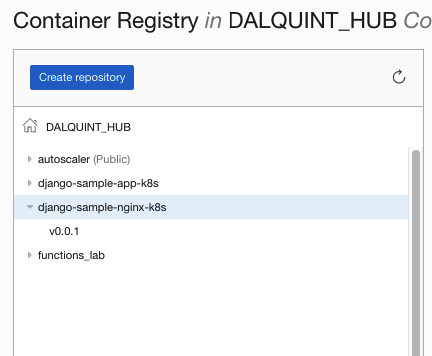


# Add secrets for production deployment

1. Execute the following to generate secrets based on a file

`kubectl create secret generic django-k8s-web-prod-env --from-env-file=web/.env`

Something like this will appear: 

```shell
(venv) ubuntu@dalquintubuntuarm:~/REPOS/django-k8-sample$ kubectl create secret generic django-k8s-web-prod-env --from-env-file=web/.env
secret/django-k8s-web-prod-env created
```

2. To verify secret got created correctly, run: 

`kubectl get secret django-k8s-web-prod-env -o YAML`

```shell
(venv) ubuntu@dalquintubuntuarm:~/REPOS/django-k8-sample$ kubectl get secret django-k8s-web-prod-env -o YAML
apiVersion: v1
data:
  DEBUG: MQ==
  DJANGO_SECRET_KEY: Zml4X3RoaXNfbGF0ZXI=
  DJANGO_SUPERUSER_EMAIL: ZHJhbHF1aW50YUBnbWFpbC5jb20=
  DJANGO_SUPERUSER_PASSWORD: ZDNubnk0bHF1MW5UYQ==
  DJANGO_SUPERUSER_USERNAME: ZGFscXVpbnQ=
  MYSQL_DB: ZGphbmdv
  MYSQL_HOST: MTAuMC4yLjE5Ng==
  MYSQL_PASSWORD: VzNsYzBtMzEu
  MYSQL_PORT: MzMwNg==
  MYSQL_READY: MQ==
  MYSQL_ROOT_PASSWORD: VzNsYzBtMzEu
kind: Secret
metadata:
  creationTimestamp: "2022-03-24T20:56:23Z"
  name: django-k8s-web-prod-env
  namespace: default
  resourceVersion: "49606"
  uid: 0f0f0856-799d-46c5-b62e-f2edc3a040ee
type: Opaque
```

# Generate django deployment

1. Generate an OCIR Secret to later embed into yaml file

run: `kubectl create secret docker-registry ocirsecret --docker-server=sa-santiago-1.ocir.io --docker-username='idhkis4m3p5e/oracleidentitycloudservice/denny.alquinta@oracle.com' --docker-password='YOUR_AUTH_TOKEN' --docker-email='denny.alquinta@oracle.com'`

You'll see something like this: 

```shell
(venv) ubuntu@dalquintubuntuarm:~/REPOS/django-k8-sample$ kubectl create secret docker-registry ocirsecret --docker-server=sa-santiago-1.ocir.io --docker-username='idhkis4m3p5e/oracleidentitycloudservice/denny.alquinta@oracle.com' --docker-password='YOUR_AUTH_TOKEN' --docker-email='denny.alquinta@oracle.com'
secret/ocirsecret created
```


2. Create the yaml file django-k8s-web.yaml

3. Deploy the container: 

`kubectl apply -f k8s_deployment/apps/django-k8s-web.yaml`


4. If everything went fine, this is what you should get: 

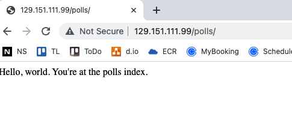


# Database side

1. Pre-create a MySQL Database and get credetials and coordinates
2. Connect into database and create the django DB for later usage. To do so: 

`mysql --host=10.0.2.196 --user=root --password=W3lc0m31.`

```shell
mysql> show databases;
+--------------------+
| Database           |
+--------------------+
| information_schema |
| mysql              |
| performance_schema |
| sys                |
+--------------------+
4 rows in set (0.00 sec)

mysql> CREATE DATABASE django;
Query OK, 1 row affected (0.01 sec)

mysql> show databases;
+--------------------+
| Database           |
+--------------------+
| django             |
| information_schema |
| mysql              |
| performance_schema |
| sys                |
+--------------------+
5 rows in set (0.00 sec)
```


# Finishing

If everything went fine, a LBaaS Should have been created as below: 

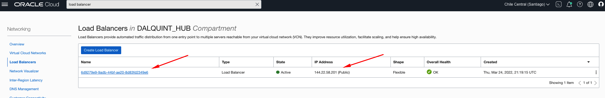

and if accessing to this, you'll see this: 


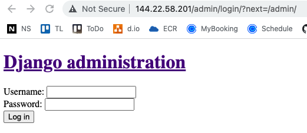


For do rollout deployment: 

`kubectl rollout status deployment/django-k9s-web`


---

# To create an application

1. Make sure your host has the MySQL Client files and binaries. In the case of ubuntu: 

```shell
Step 0: sudo apt install python3-dev build-essential

Step 1: sudo apt install libssl1.1

Step 2: sudo apt install libssl1.1=1.1.1f-1ubuntu2

Step 3: sudo apt install libssl-dev

Step 4: sudo apt install libmysqlclient-dev

Step 5: pip3 install mysqlclient
```

2. Then re-run `dependencies.sh`

3. Now run: (Based on: https://docs.djangoproject.com/en/4.0/intro/tutorial01/)

`python3 manage.py startapp polls`


4. Create a file under `polls/urls.py` that looks like this: 

```python
from django.urls import path

from . import views

urlpatterns = [
    path('', views.index, name='index'),
]
```

5. Modify file `django_k8s/urls.py` to look like this: 

```python
from django.contrib import admin
from django.urls import include, path

urlpatterns = [
    path('polls/', include('polls.urls')),
    path('admin/', admin.site.urls),
]
```

6. Rebuild, retag and push the image: 

`docker tag django-k8s:v0.0.2 sa-santiago-1.ocir.io/idhkis4m3p5e/django-example:v0.0.2`
`docker push sa-santiago-1.ocir.io/idhkis4m3p5e/django-example:v0.0.2`


It'll look like this: 

```shell
(venv) ubuntu@dalquintubuntuarm:~/REPOS/django-k8-sample/web/polls$ docker image ls
REPOSITORY                                          TAG            IMAGE ID       CREATED         SIZE
django-k8s                                          v0.0.2         a5e481cfe439   2 minutes ago   582MB
sa-santiago-1.ocir.io/idhkis4m3p5e/django-example   v0.0.2         a5e481cfe439   2 minutes ago   582MB
mysql                                               oracle         00c014d8ea9c   13 hours ago    486MB
python                                              3.8.5-alpine   da3ea875dbcd   18 months ago   41.9MB
(venv) ubuntu@dalquintubuntuarm:~/REPOS/django-k8-sample/web/polls$ docker push sa-santiago-1.ocir.io/idhkis4m3p5e/django-example:v0.0.2
The push refers to repository [sa-santiago-1.ocir.io/idhkis4m3p5e/django-example]
cc9f1bced2fd: Pushed 
f5d27dd3a9b7: Pushed 
81bb673d2af6: Pushed 
6b8c463dd40c: Pushed 
50391f846464: Pushed 
0c5b2785074b: Layer already exists 
27da86305d5e: Layer already exists 
798cb960efb8: Layer already exists 
8691b6bf9361: Layer already exists 
e2f13739ad41: Layer already exists 
v0.0.2: digest: sha256:0126c15ccb3b830efdf47dd09b69fc27896fe84ac72c5309a298722f3ca1806c size: 2423
```


7. If everything went fine, then the deploy will look like this: 

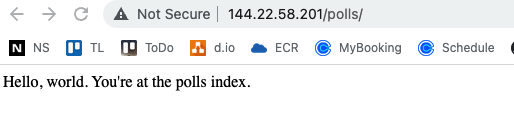


---

# Pod Autoscaling

To implement pod horizontal autoscaling first we need the metrics server on a cluster using Kubectl. To do so: 


0. Make sure that the Deployment where you are applying the autoscaler contains definitions for both limits and requests on the CPU side. If not, the readiness of the pod will not be computed and the autoscaler will fail. 

This is an excerpt of the yaml file: 

```yaml
apiVersion: apps/v1
kind: Deployment
metadata:
  name: django-k8s-web-deployment
  labels:
    app: django-k8s-web-deployment
spec:
  replicas: 3
  selector:
    matchLabels:
      app: django-k8s-web-deployment
  template:
    metadata:
      labels:
        app: django-k8s-web-deployment
    spec:
      containers:
      - name: django-k8s-web
        image: sa-santiago-1.ocir.io/idhkis4m3p5e/django-sample-app-k8s:v0.0.1
        imagePullPolicy: Always
        envFrom:
          - secretRef:
              name: django-k8s-web-prod-env
        ports:
        - containerPort: 8000
        resources:
          limits:
            cpu: 500m
          requests:
            cpu: 200m
        env:
          - name: PORT
            value: "8000"
      imagePullSecrets:
        - name: ocirsecret
```


1. Execute: 

`kubectl apply -f https://github.com/kubernetes-sigs/metrics-server/releases/download/<version-number>/components.yaml`

or: 

`kubectl apply -f https://github.com/kubernetes-sigs/metrics-server/releases/latest/download/components.yaml`

Where: 
<version-number>: The version of the helm chart to install. Versions available here: https://github.com/kubernetes-sigs/metrics-server/releases

For this case: 

```shell

(venv) ubuntu@dalquintubuntuarm:~/REPOS/django-k8-sample$ kubectl apply -f https://github.com/kubernetes-sigs/metrics-server/releases/latest/download/components.yaml
serviceaccount/metrics-server created
clusterrole.rbac.authorization.k8s.io/system:aggregated-metrics-reader created
clusterrole.rbac.authorization.k8s.io/system:metrics-server created
rolebinding.rbac.authorization.k8s.io/metrics-server-auth-reader created
clusterrolebinding.rbac.authorization.k8s.io/metrics-server:system:auth-delegator created
clusterrolebinding.rbac.authorization.k8s.io/system:metrics-server created
service/metrics-server created
deployment.apps/metrics-server created
apiservice.apiregistration.k8s.io/v1beta1.metrics.k8s.io created

```

2. To make sure is running, run: 

```shell
(venv) ubuntu@dalquintubuntuarm:~/REPOS/django-k8-sample$ kubectl get deployment metrics-server -n kube-system
NAME             READY   UP-TO-DATE   AVAILABLE   AGE
metrics-server   1/1     1            1           46s

```

3. Deploy Horizontal Pod Autoscaling on top of our deployments: 

`kubectl autoscale deployment django-k8s-web-deployment --cpu-percent=10 --min=1 --max=10`

```shell
(venv) ubuntu@dalquintubuntuarm:~/REPOS/django-k8-sample$ kubectl autoscale deployment django-k8s-web-deployment --cpu-percent=10 --min=1 --max=10
horizontalpodautoscaler.autoscaling/django-k8s-web-deployment autoscaled
```

`kubectl autoscale deployment nginx-deployment --cpu-percent=10 --min=1 --max=10`
 
In this case, we will scale the pods from 1 to 10 whenever the CPU% is larger than 10%


To do load testing, use BusyBox like this: 

```shell

kubectl run -i --tty load-generator-X --rm --image=busybox:1.28 --restart=Never -- /bin/sh -c "while sleep 0.01; do wget -q -O- http://LBAAS_PUBLIC_IP/polls/; done"

```

Where: 

X: scale this up as much as needed to generate an increase on load
LBAAS_PUBLIC_IP: Get this from the console or from the service

---

# Github Actions

The github actions code can be found [here](.github/workflows). 

The actions were generated to provide a way for automatic deployment. They include:
- A [test](.github/workflows/test.yaml) file which runs any tests included in [manage.py](web/manage.py) to ensure that Django is configured correctly and
- A [build](.github/workflows/build.yaml) file which builds all necessary parts for the deployment onto a linux/arm64 OKE cluster. 

To run the actions correctly you will need to configure the following [Github Actions Secrtes](https://docs.github.com/en/actions/security-guides/security-hardening-for-github-actions) in your own repository. The link included provides a guide on how to do so. 

In order to input your `Secrets` navigate to the main page of the repository, click on the `Settings` tab, click `Secrets` and then click on `Add a new secret`.

The following variables Secrets were added onto this repo:

**The variables included in the Django .env file:**

- **DJANGO_SECRET_KEY**: Your Django Secret Key 
- **DJANGO_SUPERUSER_EMAIL**: Your Django superuser email 
- **DJANGO_SUPERUSER_PASSWORD**: Your Django superuser password 
- **DJANGO_SUPERUSER_USERNAME**: Your Django superuser username 

- **MYSQL_DB**: The name of the database 
- **MYSQL_HOST**: The IP of the database 
- **MYSQL_PASSWORD**: The database password 
- **MYSQL_PORT**: The database port 
- **MYSQL_READY**: Whether the database exists 
- **MYSQL_ROOT_PASSWORD**: The database root password 
- **MYSQL_USER**: Name of the database user 


**OCI Specific variables:**

- **ID_RSA**: The key located in ~/.ssh/id_rsa on your OCI instance 
- **ID_RSA_PUB**: The key located in ~/.ssh/id_rsa.pub on your OCI instance 
- **KUBECONFIG**: The kube config file located in .kube/config of your instance 
- **OCIR_LOGIN**: The login to your Oracle Container Registry account. Please include the single quotes in the secret description. Eg: 'idhkixxx/oracleidentitycloudservice/xxx.xxx@oracle.com'
- **OCIR_PASS**: The password to your Oracle Container Registry accounr. Please include the single quotes in the secret description. Eg: '12kli2/a3ete3sd-u'
- **OCI_CONFIG**: Your OCI config file found under ~/.oci/config on your OCI instance. 
- **OCI_KEY_FILE**: Your OCI .pem key which found under ~/.oci/key.pem or ~/.oci/API_KEYS/key.pem on your OCI instance

The Secrets should then appear like so:

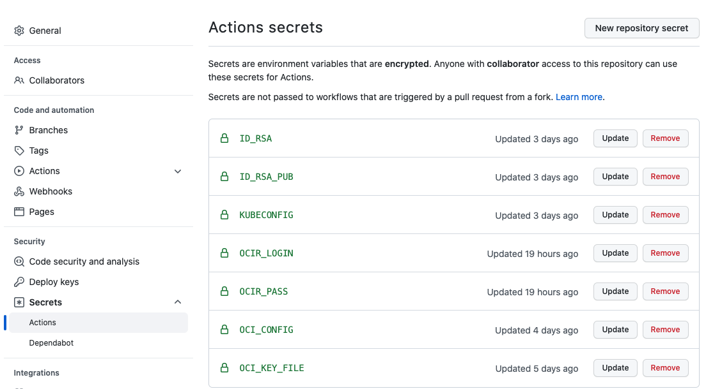


Please note that for KUBECONFIG to work you must change the `server: https://x.x.x.x:6443` included in your original config file to `server: https://127.0.0.1:6443` and then upload the file as a secret. 

In order to connect to the private OKE cluster a bastion session is being created and destroyed in the last step of the deployment. Make sure to change the bastion id `--bastion-id "ocid1.bastion.oc1.uk-london-1.amaaaaaatwfhi7yan2s3sdth7yjcw4hpa3o32uebmrlideeocv5xl2lajknq"` in line 96 of the [build](.github/workflows/build.yaml) file to contain your own bastion id. 

Lastly do make sure to also change the image names in the [build](.github/workflows/build.yaml) file to correspond to your container repository name. 

# Shared File System

Prerequisites:
- Pre-created Mount Target
- Pre-created File System for Nginx static content
- Pre-created File System for Django app media content

You will need:
- OCID of Mount Target
- IP Address of Mount Target
- An export path of your File Systems

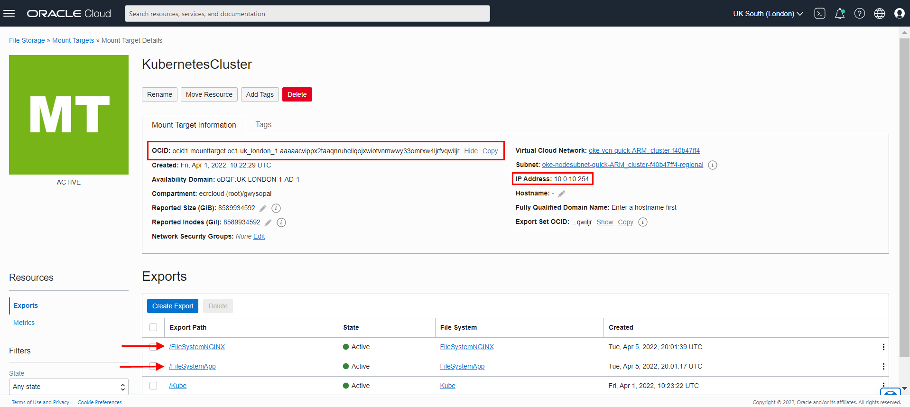

First of all, adjust the specific values for your File System inside django-k8-sample/k8s_deployment/Storage

1. Paste your Mount Target OCID to StorageClass.yaml:

```yaml
apiVersion: storage.k8s.io/v1
kind: StorageClass
metadata:
  name: oci-fss
provisioner: oracle.com/oci-fss
parameters:
  mntTargetId: MY_MOUNT_TARGET_OCID
```
2. Paste your Mount Target IP and export path to PV.yaml:

```yaml
apiVersion: v1
kind: PersistentVolume
metadata:
 name: pv-fss-app
spec:
 storageClassName: oci-fss
 capacity:
  storage: 100Gi
 accessModes:
  - ReadWriteMany
 mountOptions:
  - nosuid
 nfs:
  server: MY_MOUNT_TARGET_IP          
  path: MY_FILE_SYSTEM_EXPORT_PATH         
  readOnly: false
```

The default mount paths are:
- for NGINX, /home/app/microservice/static
- for Django app, app/media/

Rebuild, retag and push the image to the repository.

Deploy the Persistent Volume storage and its components to the Kubernetes cluster:

`kubectl apply -f ~/django-k8-sample/k8s_deployment/Storage`

You should see:

```shell
ubuntu@ubuntuarm:~/k8s_django/django-k8-sample/k8s_deployment$ k apply -f Storage
persistentvolume/pv-fss-app created
persistentvolume/pv-fss-nginx created
persistentvolumeclaim/pvc-fss-app craeted
persistentvolumeclaim/pvc-fss-nginx craeted
storageclass.storage.k8s.io/oci-fss craeted
```

Secondly Deploy the application to the Kubernetes cluster with django-k8s-web-file-system.yaml:

`kubectl apply -f ~/django-k8-sample/k8s_deployment/apps/django-k8s-web-file-system.yaml`

It should look like this:

```shell
ubuntu@ubuntuarm:~/k8s_django/django-k8-sample/k8s_deployment/apps$ k apply -f django-k8s-web.yaml 
deployment.apps/django-k8s-web-deployment created
service/django-k8s-web-service created
deployment.apps/nginx-deployment created
service/nginx-service-lbaas created
```
Now, let's test the newly created File System by typing <load-balancer-public-ip/upload> into the browser:

1. Choose a file to upload to the File System
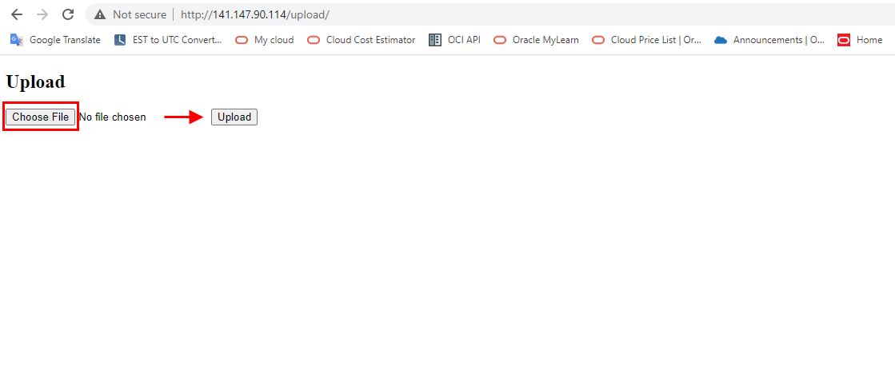
2. Press the Upload button, which will automatically generate a URL for you where you can check if the file was uploaded correctly
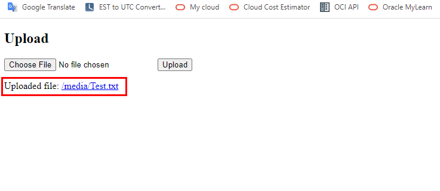
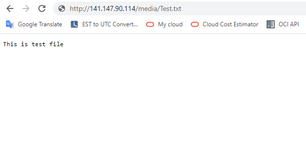

3. To Access static content served by NGINX, go to : <load-balancer-public-ip/static/>

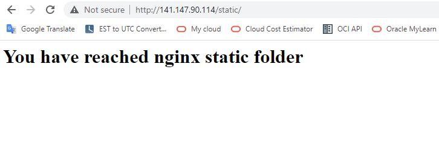


# SSL with kubernetes

## User managed certificates

Prerequisites:
 - sample app deployed from previous steps
 - certificates for your website

1. Copy your Load Balancer public IP:

'kubectl get svc'

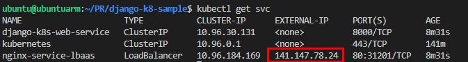

2. Add DNS **A** record with your LB public IP:

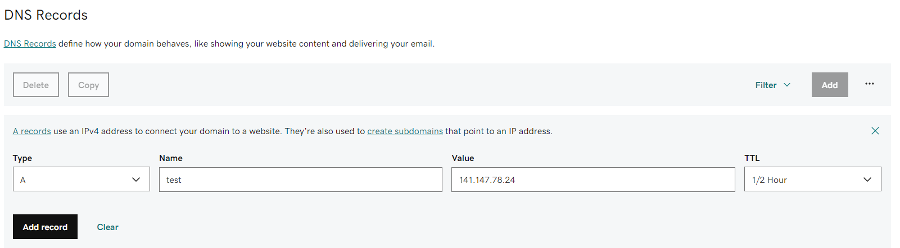

3. Modify generate_cert.sh to include your website domain name:

```shell
cd ~/django-k8-sample/k8s_deployment/SSL
```

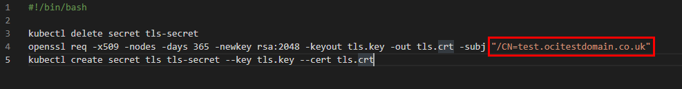

4. Generate self signed certificate for your website by running generate_cert.sh script:

```shell
./generate_cert.sh
```
You should expect to see:

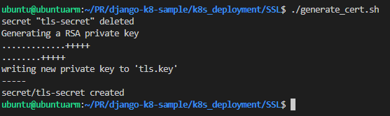


The certificate will be stored in kubernetes secret under the name tls-secret.

Now update Load balancer to enable HTTPS connectivity by applying LB.yaml:

```shell
kubectl apply -f LB.yaml
```
Now you can connect to your website over HTTPS however the certificate will not be recognised by your browser.

In order to apply your own valid certificate, delete secret and upload tls.crt with tls.key file and create new secret:

```shell
kubectl delete secret tls-secret
kubectl create secret tls tls-secret --key path_to_your_key/tls.crt --cert path_to_your_cert/tls.key
```

Load balancer will automatically access and apply the secret

In effect your website should be accesable over HTTPS without warning

## Auto generated and maintained certificates with cert-manager and Let's encrypt

1. Delete previous deployments
2. Create new sample app with django-k8s-web-auto-ssl.yaml:

```shell
kubectl apply -f ~/django-k8-sample/k8s_deployment/apps/django-k8s-web-auto-ssl.yaml
```
3. Install required services:

  - Install helm from [Official Website](https://helm.sh/docs/intro/install/)
  - Deploy ingress-nginx from [Official Website](https://kubernetes.github.io/ingress-nginx/deploy/)

  Check if deployment was successfull by listing all ingress-nginx components

  ```shell
  kubectl get all -n ingress-nginx
  ```

  You should see:

  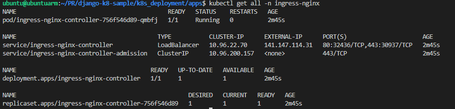

  - Deploy cert-manager from [Official Website](https://cert-manager.io/docs/installation/)

  Check if deployment was successfull by listing all cert-manager components

  ```shell
  kubectl get all -n cert-manager
  ```
  You should see:

  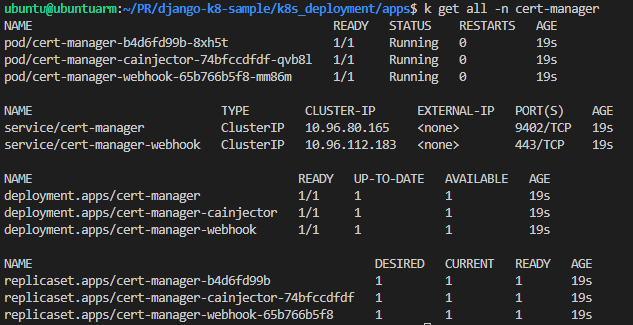

4. Copy your new Load balancer public IP:

```shell
  kubectl get svc
```


Add DNS A record with your LB public IP:


5. Modify following yaml files:

  - cert_issuer.yaml

  Update your email:

  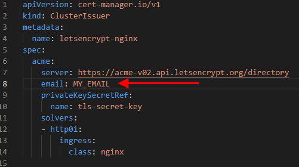

  - certificate.yaml

  Update your domain name:

  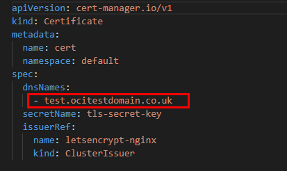

  - ingress.yaml

  Update your domain name:

  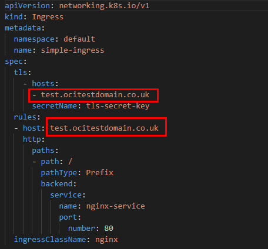

6. Apply all the 3 yaml files you just modified in the following order:

```shell
kubectl apply -f cert_issuer.yaml
kubectl apply -f ingress.yaml
kubectl apply -f certificate.yaml
```
If everything went well the certificate was generated. To see details run command:

```shell
kubectl describe certificate cert
```
You should see:

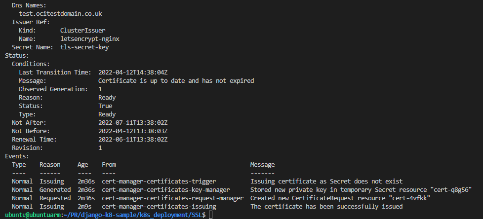

7. Acces your website over HTTPS and enjoy automatic certification updates:

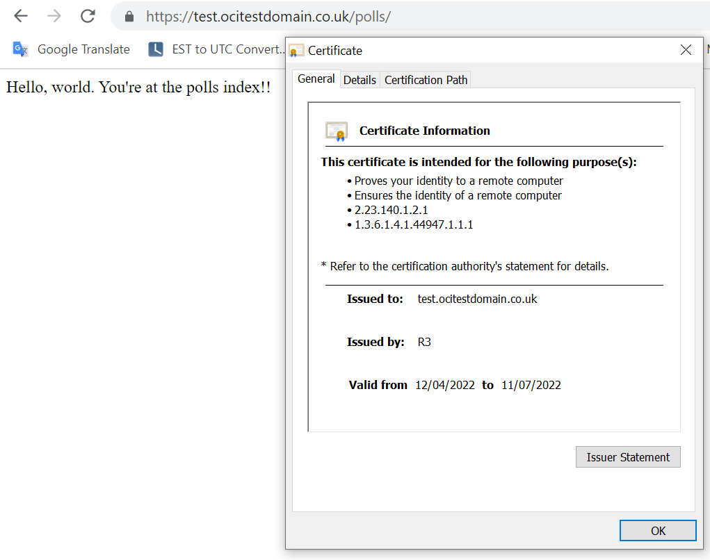


