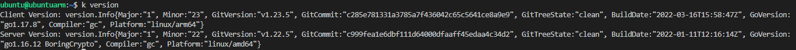
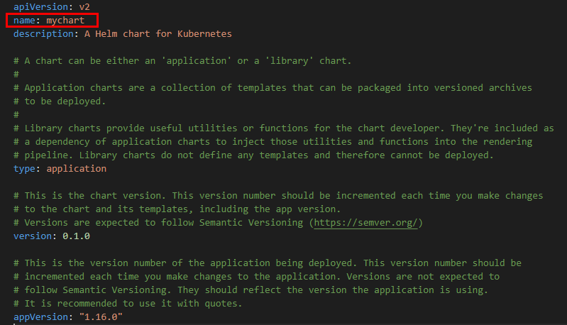
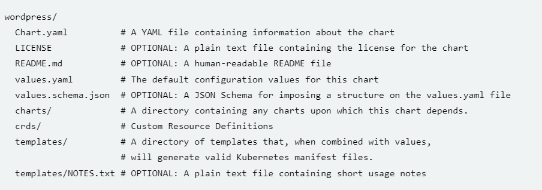
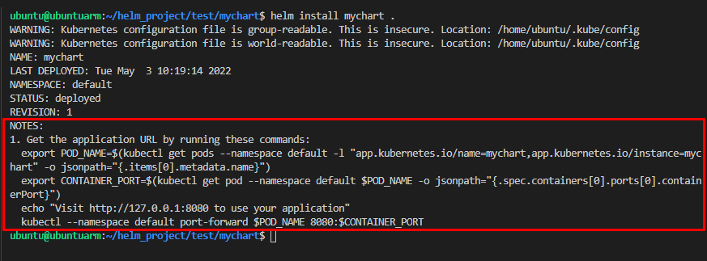

# Build your first Helm chart

### <ins>The following Guide includes
- how to create your Helm chart from a template
- how to operate on Helm chart values and functions
- how to set up dependencies (other helm charts to be deployed before your deployment)

### <ins> 1. Install Helm
Follow a simple installation guide from the [Official Website.](https://helm.sh/)

### <ins> 2. Create Helm chart template

Helm provides a template chart structure to kickstart your project. Simply type the following command:

```shell 
helm create mychart
```

The [mychart](./mychart/) directory will be created in a current path.

The created project will include all the standard files and directories used in a Helm chart.


[mychart](./mychart/) is already a valid Helm chart ready to be deployed on your cluster.

**Make sure** that your cluster is configured and running by typing:

```shell
kubectl version
```
You should see:



To deploy the newly created Helm chart, firstly get the chart name located in [Chart.yaml](./Chart.yaml):



Ensure you are in the project directory or specify the path to the chart. Install a chart with the following command:

```shell
cd ~/mychart
helm install mychart .
```
You should see:

```shell
ubuntu@ubuntuarm:~/helm_project/test/mychart$ helm install mychart .
NAME: mychart
LAST DEPLOYED: Tue May  3 09:40:16 2022
NAMESPACE: default
STATUS: deployed
REVISION: 1
NOTES:
1. Get the application URL by running these commands:
  export POD_NAME=$(kubectl get pods --namespace default -l "app.kubernetes.io/name=mychart,app.kubernetes.io/instance=mychart" -o jsonpath="{.items[0].metadata.name}")
  export CONTAINER_PORT=$(kubectl get pod --namespace default $POD_NAME -o jsonpath="{.spec.containers[0].ports[0].containerPort}")
  echo "Visit http://127.0.0.1:8080 to use your application"
  kubectl --namespace default port-forward $POD_NAME 8080:$CONTAINER_PORT
```

To see all charts already deployed, follow the command:

`helm list`

You should see:

```bash
ubuntu@ubuntuarm:~/helm_project/test/mychart$ helm list
NAME    NAMESPACE       REVISION        UPDATED                                 STATUS          CHART           APP VERSION
mychart default         1               2022-05-03 09:40:16.509131236 +0000 UTC deployed        mychart-0.1.0   1.16.0     
```
To uninstall your chart deployment ,simply type uninstall command together with the chart name:

```shell
helm uninstall mychart
```

You will see:

```shell
ubuntu@ubuntuarm:~/helm_project/test/mychart$ helm uninstall mychart
release "mychart" uninstalled
```

### <ins> 3. Template files explanation

Let's look into all the different files you will need for your Helm chart.



Below is a simple explanation of the essential parts of a Helm chart you will need for your project.


- [Chart.yaml](./mychart/Chart.yaml) is essential for the Helm chart to work. The complete explanation of all the required and optional fields you can find [here](https://helm.sh/docs/topics/charts/). Below is a short explanation of the required fields for your test deployment:

    * `apiVersion:` it should be **v2** for Helm charts that require at least Helm 3. Charts supporting previous Helm versions have an apiVersion set to v1 and are still installable by Helm 3. 

    * `name:` this is the name of your chart. It has the same name you typed while creating a template, which can be freely changed.

    * `version:` version of your chart. Please keep in mind that you must follow  [SemVer2](https://semver.org/spec/v2.0.0.html) versioning **e.g. 1.2.3**

- [charts](./mychart/charts), the folder currently empty, will contain all the dependencies (other helm charts) you will need for your deployment to work.

- [templates](./mychart/templates), this directory includes all your .yaml files required for your deployment. In addition, there is _helpers.tpl file, which contains any function you will need to adjust your variables.

- [NOTES.txt](./mychart/templates/NOTES.txt), are all the notes you want to include, which will be displayed upon successful deployment like below:



- [values.yaml](./mychart/values.yaml) is a file which holds all adjustable variables you want to use for your deployment. The variables can be adjusted in any `key: value` in your .yaml files located in the [templates](./mychart/templates/).

### <ins> 4. Your first Helm chart

**4.1. We will create a simple deployment of a ConfigMap to showcase how the charts work. Go back to previously created [template Helm chart](./mychart) and delete content of [templates](./mychart/templates/) directory and clear content of [values.yaml](./mychart/)** 

**4.2.** Create a new `test.yaml` file inside templates with the following content:

```yaml
apiVersion: v1
kind: ConfigMap
metadata:
  name: mychart-configmap
data:
  myvalue: "Hello World"

```
**4.3** In order to adjust any values, you have to follow the specific syntax. As an example, we will change the name of our ConfigMap below:

  Inside [values.yaml](./mychart/values.yaml) you can specify your variables directly or with a depth, like below:

```yaml
name: testing-config-map
```
OR
```yaml
configmap:
  name: testing-config-map
```

To utilise your custom values inside your templates, follow the below syntax:

```yaml
{{.Values.name}}
or
{{.Values.configmap.name}}
```
In effect, your ConfigMap should look like this:

```yaml

apiVersion: v1
kind: ConfigMap
metadata:
  name: {{.Values.configmap.name}}
data:
  myvalue: "Hello World" 

```
Let's test if the values are indeed adjusted during deployment.You can see what will be deployed without actual deployment with the following command:

`helm install --debug --dry-run mychart .`

As presented below, you can see that the name you specified in [values.yaml](./mychart/values.yaml) was succesfully implemented to the ConfigMap:

```bash
ubuntu@ubuntuarm:~/helm_project/test/mychart$ helm install --debug --dry-run mychart .

install.go:178: [debug] Original chart version: ""
install.go:199: [debug] CHART PATH: /home/ubuntu/helm_project/test/mychart

NAME: mychart
LAST DEPLOYED: Tue May  3 13:05:11 2022
NAMESPACE: default
STATUS: pending-install
REVISION: 1
TEST SUITE: None
USER-SUPPLIED VALUES:
{}

COMPUTED VALUES:
configmap:
  name: testing-config-map

HOOKS:
MANIFEST:
---
# Source: mychart/templates/test.yaml
apiVersion: v1
kind: ConfigMap
metadata:
  name: testing-config-map
data:
  myvalue: "Hello World"
```
**4.4.** Functions

You can also apply predefined functions or declared by you in .tpl file to manipulate or standardise your values.

Helm allows you to use [70 predefined functions](https://masterminds.github.io/sprig/).

Let's take a look at a `quote` function.
The quote function will put " " quotes around a value; this is extremely helpful if your values have to follow the specific syntax.

To apply a function to a value you can simply do that by typing: ` some_value | your_function`

Now modify your ConfigMap as follows:

```yaml
apiVersion: v1
kind: ConfigMap
metadata:
  name: {{.Values.configmap.name | quote }}
data:
  myvalue: "Hello World" 
```

Test if it worked with dry run deployment:

`helm install --debug --dry-run mychart .`

Below is the output; you can see that the quotes were applied to the ConfigMap name:

```bash
ubuntu@ubuntuarm:~/helm_project/test/mychart$ helm install --debug --dry-run mychart .
install.go:178: [debug] Original chart version: ""
install.go:199: [debug] CHART PATH: /home/ubuntu/helm_project/test/mychart

NAME: mychart
LAST DEPLOYED: Tue May  3 13:15:30 2022
NAMESPACE: default
STATUS: pending-install
REVISION: 1
TEST SUITE: None
USER-SUPPLIED VALUES:
{}

COMPUTED VALUES:
configmap:
  name: testing-config-map

HOOKS:
MANIFEST:
---
# Source: mychart/templates/test.yaml
apiVersion: v1
kind: ConfigMap
metadata:
  name: "testing-config-map"
data:
  myvalue: "Hello World"
```
NOTE:  If you need custom functions, you can create them in .tpl file and use them the same way as predefined.

**4.4.** Dependencies.

Typically, you would put all your relevant .yaml files in the templates directory for your deployment, and Helm would install them in a [specific order](https://github.com/helm/helm/blob/release-2.10/pkg/tiller/kind_sorter.go#L29) so everything works as it should. However, Helm won't wait for all jobs to be finished, which can cause a problem. The best solution is to deploy necessary parts as a helm chart dependencies before actual deployment. Then Helm will collect and deploy dependencies before final deployment from your templates directory.

**Dependencies are specified in a [Chart.yaml](./mychart/Chart.yaml) file e.g. :**

```yaml
# Chart.yaml
dependencies:
- name: nginx
  version: "1.2.3"
  repository: "file://../dependency_chart/nginx"
- name: memcached
  version: "3.2.1"
  repository: "https://another.example.com/charts"
```

**NOTE:** The repository can be both local or remote.

### Example

Define dependencies as below in your [Chart.yaml](./mychart/Chart.yaml) file:

```yaml
# Chart.yaml
dependencies:
- name: ingress-nginx
  version: "4.1.0"
  repository: "https://kubernetes.github.io/ingress-nginx"

```

**Before running your helm chart, you will have to collect all the dependencies unless the repo is stored locally.**

Run the following command:

`helm dependency build`

Which in will download the dependency and create its chart in [charts](./mychart/charts/) directory and also [Chart.lock](./mychart/Chart.lock) file which specifies metadata about the dependency chart:

```console
Hang tight while we grab the latest from your chart repositories...
...Successfully got an update from the "ingress-nginx" chart repository
Update Complete. ⎈Happy Helming!⎈
Saving 1 charts
Downloading ingress-nginx from repo https://kubernetes.github.io/ingress-nginx
Deleting outdated charts
```
You can also check if your dependency was successfully downloaded by running: `helm dependency list `

Also, you can update your dependency charts by running:
`helm dependency update`

**What is interesting is that you can also modify your dependencies values. Simply run the command:**

`helm show values ingress-nginx-4.1.0.tgz `

You will be faced with the list of values you can modify, then copy chosen values and paste them into your [values.yaml](./mychart/values.yaml) under the chart name you specified in your dependencies. Below we will pass the new label `test: test` to the ingress-nginx dependency deployment:

```yaml
# values.yaml
ingress-nginx:
  labels:
    test: test
```

Now dry run your helm chart to see the outcome:

`helm install--debug --dry-run mychart .`

Somewhere in the outcome, you can find that the `test: test` label was added successfully:

```bash
...
global: {}
  imagePullSecrets: []
  labels:
    test: test
  podSecurityPolicy:
    enabled: false
  rbac:
    create: true
    scope: false
...
```

This finishes quick guide for creating your own custom Helm chart. You have learnd the following:
- how to create and install your own chart from a template
- how to operate on values.yaml and functions
- how to set up dependencies and their values

This is only a great starting point.
For a more complex and complete set of information, please follow [Official Helm Website](https://helm.sh/).

### <ins> 5. Try to run and modify sample app

In the directory you can also find [sample-app-file-storage](./sample-app-file-storage/) and [sample-app-ssl](./sample-app-ssl/) Helm charts. Both of them are deploying previously used django-sample-app deployment located in the main directory. You can modify the values and try to deploy the apps with a simple `helm install` command.


